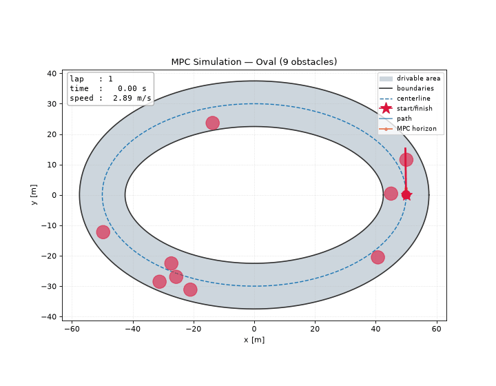
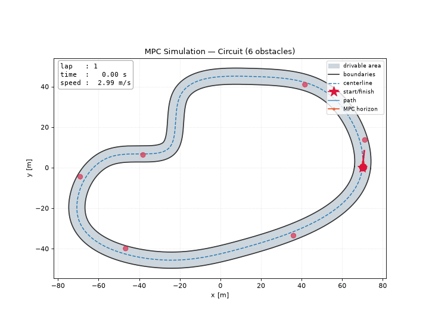
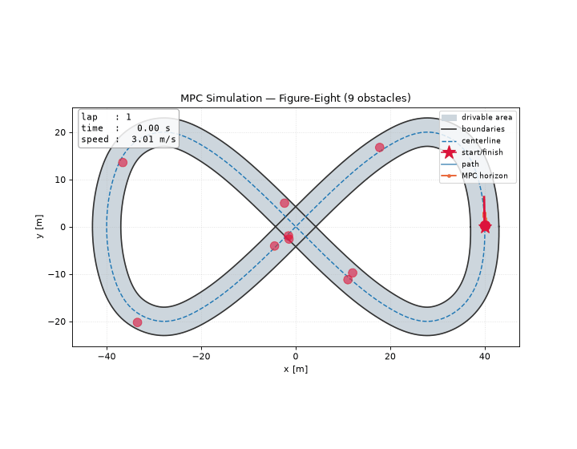
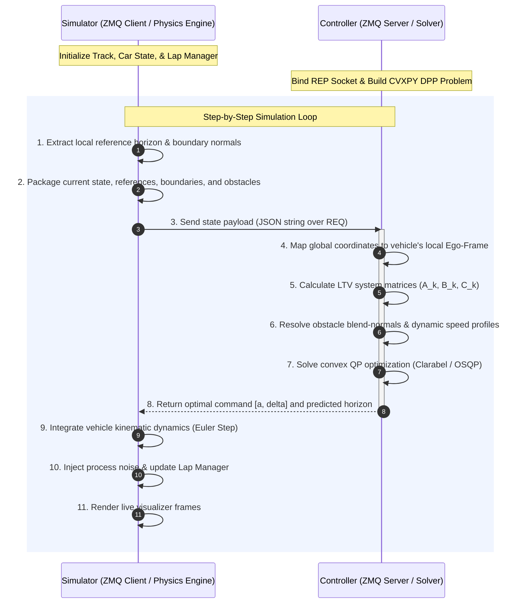

# Ackermann Car MPC Path-Tracking Simulation

This repository implements a decoupled, receding-horizon Model Predictive Control (MPC) path-tracking and obstacle avoidance framework for an Ackermann-steering vehicle. The system is split into two independent processes—a **Simulator** and a **Controller**—communicating synchronously via ZeroMQ (ZMQ) TCP sockets.

---

## Demonstrations

The hybrid LTV-MPC tracking the reference line and avoiding randomly generated obstacles on each of the three built-in tracks. Each clip is a single lap, rendered headlessly by [`scripts/render_demos.py`](scripts/render_demos.py).

### Oval


### Circuit


### Figure-Eight


---

## 1. System Architecture & Execution Sequence

The simulation is built on a decoupled Client-Server architecture to mimic real-world deployment where control computations run on a dedicated onboard or edge computer, isolated from physical sensors/actuators.



---

## 2. Repository Layout

```
ackermann_car/
├── .github/workflows/ci.yml       # Continuous Integration pipeline
├── ackermann_car/                 # Main Python package
│   ├── __init__.py
│   ├── communication/
│   │   ├── __init__.py
│   │   └── network.py             # ZMQ REQ/REP communication sockets
│   ├── controllers/
│   │   ├── __init__.py
│   │   ├── base.py                # Abstract base class for controllers
│   │   ├── mpc.py                 # Legacy MPC implementation
│   │   └── hybrid_mpc.py          # Iterative LTV-MPC with ego-projection
│   └── sim/
│       ├── __init__.py
│       ├── car.py                 # Kinematic bicycle model dynamics
│       ├── lap_manager.py         # Lap detection and timing logic
│       ├── speed_profile.py       # Curvature-based speed profile generator
│       ├── track.py               # Analytical periodic spline track representation
│       └── visualizer.py          # Headless and live Matplotlib visualizers
├── docs/
│   ├── INTERFACE.md               # API & Network payload specification
│   └── MPC_FORMULATION.md         # Detailed mathematical formulation
├── scripts/
│   └── run.py                     # Entry point for simulation execution
├── tests/
│   ├── test_comms.py              # ZMQ networking and serialization tests
│   ├── test_dynamics.py           # Kinematic bicycle integration tests
│   └── test_obstacles.py          # Controller benchmark and stress tests
├── docker-compose.yml             # Local multi-container deployment
├── Dockerfile                     # Environment definition for headless run
├── pyproject.toml                 # Package configuration
└── requirements.txt               # Pinpoint dependencies
```

---

## 3. Installation & Setup

### Prerequisites
- Python 3.9 or higher
- GCC / build-essential (for compiled QP solvers)

### Local Manual Installation
1. Clone the repository and navigate to the project directory:
   ```bash
   git clone <repository_url>
   cd ackermann_car
   ```
2. Create and activate a virtual environment:
   ```bash
   python -m venv .venv
   source .venv/bin/activate  # On Windows use: .venv\Scripts\activate
   ```
3. Install dependencies:
   ```bash
   pip install --upgrade pip
   pip install -r requirements.txt
   ```
4. Install the package in editable mode:
   ```bash
   pip install -e .
   ```

---

## 4. How to Run

The system can be executed in three configurations depending on whether you want a local unified simulation, separated manual nodes, or a containerized environment.

### Option A: Local Unified Run (Both Nodes)
The simplest way to start the simulation is to execute `run.py` without arguments. This spawns the Controller as a subprocess and runs the Simulator in the main thread:
```bash
python scripts/run.py
```
*Note: If no display server is detected (e.g., in a headless server or CI environment), the script switches to a headless backend, runs the simulation, and saves an animated GIF of the run to `output/simulation.gif`.*

### Option B: Local Disjoint Run (Two Terminals)
For debugging, you can launch the Controller server and Simulator client in separate shell environments.

- **Terminal 1 (Controller Server):**
  ```bash
  python scripts/run.py --mode controller --host 127.0.0.1 --port 5555
  ```
- **Terminal 2 (Simulator Client):**
  ```bash
  python scripts/run.py --mode simulator --host 127.0.0.1 --port 5555
  ```

### Option C: Containerized Deployment (Docker Compose)
To run the full stack within isolated containers (useful for verifying environment consistency and headless operation):
```bash
docker compose up --build
```
This command starts the controller service first, performs a socket-based health check, and then launches the simulator service. All frame animations or fallback static trajectory plots will be saved to the `./output` folder on your host machine via volume mounts.

---

## 5. Testing and Benchmarking

Tests are implemented using `pytest` and can be run locally or inside Docker:

```bash
# Run all standard unit tests
pytest

# Run the controller benchmark comparison (OSQP vs. Clarabel)
export RUN_COMPARISON=1
pytest -s tests/test_obstacles.py
```
